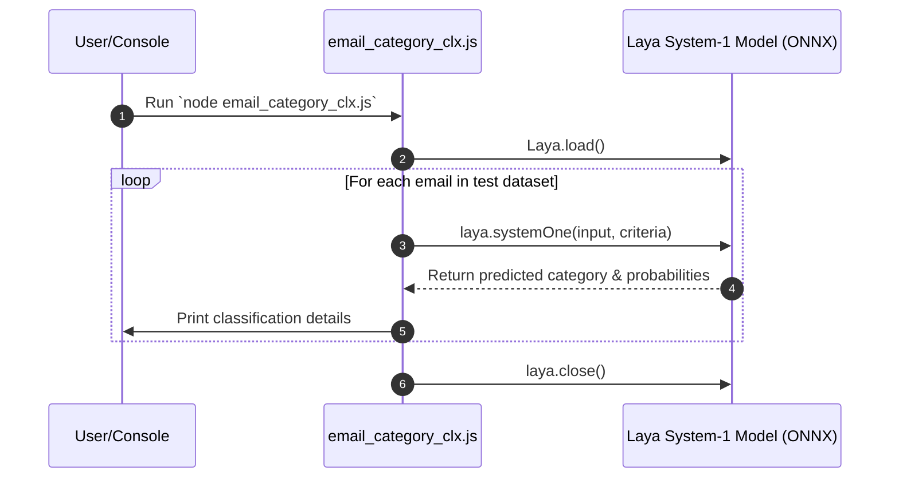

# Email Category Classifier - Design Specification

## 1. Overview
The Email Category Classifier is a Node.js console application that uses the `@receptron/laya` System-1 decision model to categorize incoming emails based on their subject line and body text.

## 2. Architecture & Tech Stack
- **Runtime Environment**: Node.js (ES Modules, `"type": "module"`)
- **Inference Engine**: `@receptron/laya` (Laya System-1 ONNX model executed locally via `onnxruntime-node`)
- **Execution Script**: [email_category_clx.js](file:///home/gvmuthu/code/systemone/txtfiles-1/email_category_clx.js)

---

## 3. Input Data Model
Each email object passed into the classification model consists of:
| Property | Type | Description |
| :--- | :--- | :--- |
| `subject` | `string` | The email subject line |
| `body` | `string` | The main body content of the email |

---

## 4. Classification Categories & Criteria

The model evaluates inputs against four predefined target choices:

| Category | Description / Criteria |
| :--- | :--- |
| **Inbox** | Direct personal or work correspondence, team discussions, and important direct communications. |
| **Updates** | System notifications, security alerts, transaction receipts, automated status updates, and confirmation messages. |
| **Promotion** | Marketing communications, newsletters, discount offers, product announcements, and promotional sales. |
| **Spam** | Phishing attempts, scam offers, unsolicited spam, and suspicious monetary claims. |

---

## 5. Output Schema
The `laya.systemOne()` call returns a result object structured as:

```json
{
  "answers": {
    "category": {
      "choice": "Inbox | Updates | Promotion | Spam",
      "probabilities": {
        "Inbox": 0.5625,
        "Updates": 0.2408,
        "Promotion": 0.1299,
        "Spam": 0.0668
      }
    }
  },
  "usage": {
    "input_tokens": 123
  }
}
```

---

## 6. Execution Flow



---

## 7. How to Run
```bash
node email_category_clx.js
```
