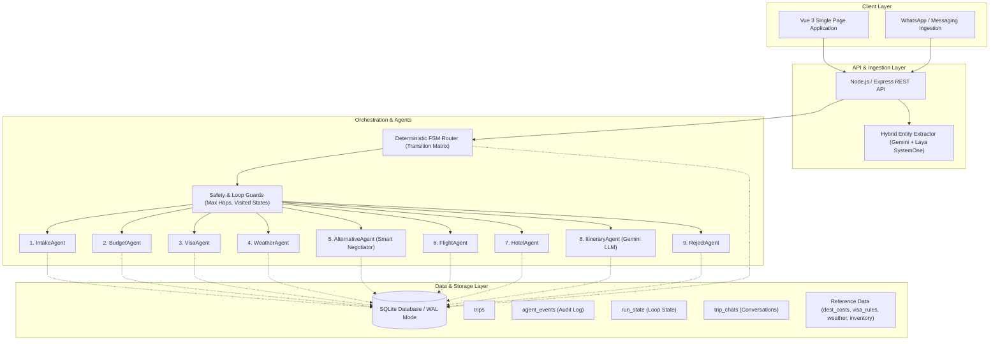
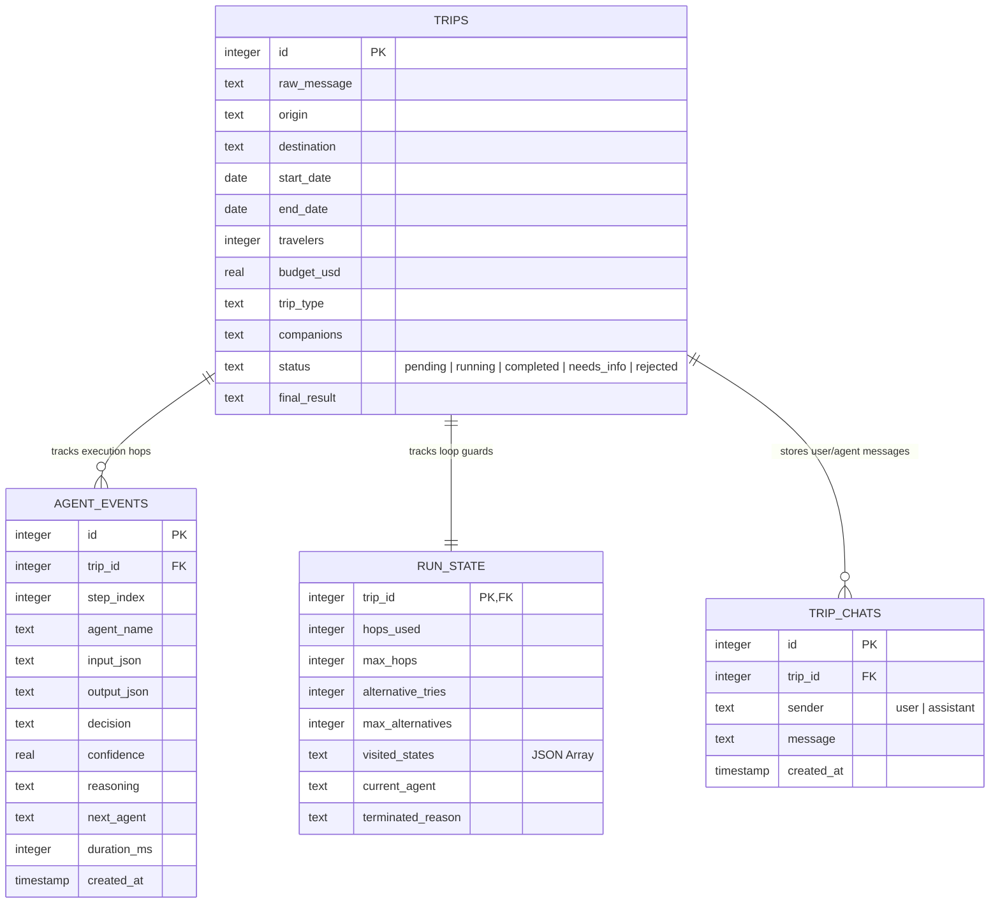
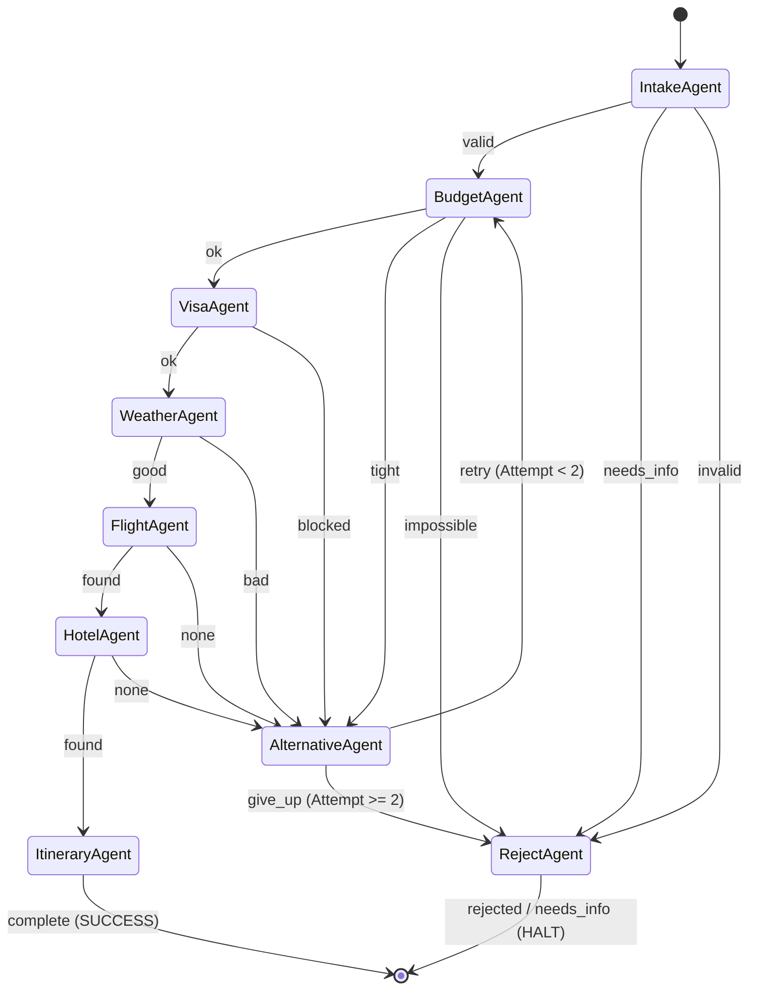
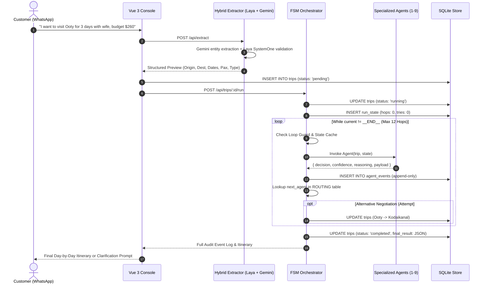

# Software Design Specification: Deterministic Multi-Agent Travel Planning System (WanderWise)

## Executive Summary
This document specifies the software architecture, design patterns, and engineering principles behind **WanderWise**, an enterprise-grade agentic AI travel planning and orchestration system. 

Unlike naive LLM-as-orchestrator designs that suffer from unbounded non-determinism, hallucinations, and runaway API costs, WanderWise uses a **Deterministic Finite State Machine (FSM) Orchestrator** paired with **Specialized Micro-Agents**. LLMs are utilized strictly as "leaf-node" cognitive tools for semantic parsing and creative synthesis, while business logic, routing, policy constraints, and audit logging remain 100% deterministic and auditable.

---

## 1. Architectural Philosophy & Core Principles

```
  Traditional Fragile Pattern:
  [User Message] ──> [Single Large LLM Prompt] ──> [Hallucinated Itinerary & Fake Inventory]

  WanderWise Agentic Pattern:
  [User Message] ──> [Hybrid NLP + Laya/LLM Extraction] 
                           │
                           ▼
  ┌────────────────────────────────────────────────────────┐
  │         Deterministic FSM Transition Router            │
  │     (Pure State Machine, Loop Guards, Audit Trail)     │
  └────┬──────────┬──────────┬──────────┬──────────┬───────┘
       ▼          ▼          ▼          ▼          ▼
   [Intake]   [Budget]     [Visa]   [Weather]  [Alternative]
    Agent      Agent       Agent     Agent      Negotiator
```

1. **Deterministic Orchestration (No LLM as Router):** Agents are pure functions with strict input/output contracts. The orchestrator is the **only** entity that decides the next step using a rigid transition matrix.
2. **Immutable Audit Trail:** Every single hop is logged to an append-only `agent_events` table with inputs, outputs, decisions, confidence scores, and latencies.
3. **Rigid Safety Guards:** Built-in loop protection prevents infinite recursion using cycle detection, maximum hop caps, and recovery attempt counters.
4. **Hybrid Cognitive Pipeline:** Combines low-latency semantic classifiers (`@receptron/laya`), generative foundation models (Google Gemini), and local database indices.

---

## 2. System Architecture



---

## 3. Database Schema Design

The system runs on SQLite with Write-Ahead Logging (`WAL`) enabled for concurrent reads and writes, portable to PostgreSQL.



---

## 4. Multi-Agent Finite State Machine (FSM)

### 4.1 State Transition Matrix

The orchestrator reads the pair `(current_agent, decision)` and looks up `next_agent`:

| Current Agent | Emitted Decision | Next Target Agent | Semantic Meaning |
|---|---|---|---|
| **IntakeAgent** | `valid` | `BudgetAgent` | All core parameters valid; proceed to financial check |
| **IntakeAgent** | `needs_info` | `RejectAgent` | Incomplete request; trigger customer clarification |
| **IntakeAgent** | `invalid` | `RejectAgent` | Unparseable or bogus parameters |
| **BudgetAgent** | `ok` | `VisaAgent` | Estimated cost fits within budget |
| **BudgetAgent** | `tight` | `AlternativeAgent` | Budget is 50%-85% of estimated cost; negotiate options |
| **BudgetAgent** | `impossible` | `RejectAgent` | Budget < 50% of cost; unrecoverable |
| **VisaAgent** | `ok` | `WeatherAgent` | Visa free or valid permit available |
| **VisaAgent** | `blocked` | `AlternativeAgent` | Entry restricted; propose alternate destination |
| **WeatherAgent** | `good` | `FlightAgent` | Travel month has favorable climate |
| **WeatherAgent** | `bad` | `AlternativeAgent` | Monsoon/landslide risks; negotiate new dates/spot |
| **AlternativeAgent** | `retry` | `BudgetAgent` | Swapped destination or shifted dates; restart validation |
| **AlternativeAgent** | `give_up` | `RejectAgent` | Retries exhausted (limit: 2 attempts) |
| **FlightAgent** | `found` | `HotelAgent` | Flight seats available within budget |
| **FlightAgent** | `none` | `AlternativeAgent` | No inventory; negotiate alternate window |
| **HotelAgent** | `found` | `ItineraryAgent` | Accommodations locked; proceed to assembly |
| **HotelAgent** | `none` | `AlternativeAgent` | No lodging available; negotiate alternate window |
| **ItineraryAgent** | `complete` | `__END__` | Synthesized final plan (Status: `COMPLETED`) |
| **RejectAgent** | `rejected` | `__END__` | Synthesized rejection/clarification (Status: `REJECTED`/`NEEDS_INFO`) |

### 4.2 State Machine Transition Diagram



---

## 5. Execution Flow & Lifecycle



---

## 6. Advanced Agentic Design Patterns Implemented

### Pattern 1: Dynamic Alternative Negotiation
When conditions are suboptimal (tight budget or monsoon season), the `AlternativeAgent` executes dynamic negotiation strategies:
1. **Location Substitution:** Substitutes expensive or crowded hotspots with regional cultural/geographic equivalents:
   * *Ooty ➔ Kodaikanal* (20% lower tariff, pine forests)
   * *Goa ➔ Gokarna* (Pristine beaches, lower lodging costs)
   * *Munnar ➔ Wayanad* (Tea plantations & eco-resorts)
   * *Manali ➔ Dharamshala* (Himalayan valleys)
2. **Date Shifting:** Shifts departure windows (+3 days) to capture lower mid-week rates and escape weekend hotel surcharges.

### Pattern 2: Multi-Turn Clarification Protocol (`needs_info`)
Rather than blindly failing or guessing when input is vague (*"I want to go somewhere nice"*), the `IntakeAgent` produces a `needs_info` decision:
* The system transitions the record to status `needs_info`.
* Emits a human-friendly prompt asking for the exact missing dimensions (e.g. departure city, preferred travel dates).
* The built-in conversational layer allows the user to clarify interactively via WhatsApp or web chat.

### Pattern 3: Loop Protection & Cycle Detection
To prevent recursive agent cycling (e.g., Budget ➔ Alternative ➔ Budget ➔ Alternative...):
* **State Signatures:** Records `current_agent:decision:attempt_number` in `run_state.visited_states`.
* **Cycle Guard:** If an identical decision is emitted within the same attempt, execution is aborted with `loop_guard`.
* **Hop Ceiling:** Strictly caps total hops at 12 steps.
* **Exhaustion Guard:** Caps alternative negotiation retries at 2.

---

## 7. Technology Stack Summary

| Layer | Technology | Rationale |
|---|---|---|
| **Runtime** | Node.js (v22 ESM) | Non-blocking I/O, fast startup, lightweight footprint |
| **Backend Framework** | Express 5 | Robust RESTful endpoint routing |
| **Database** | SQLite 3 via `better-sqlite3` | Zero-latency embedded database, WAL mode, ACID transactions |
| **Fast Intent Classification** | `@receptron/laya` | Sub-50ms local ML probability scoring & categorization |
| **Foundation LLM** | Google Gemini (`gemini-3.5-flash`) | Deep natural language extraction, structured JSON parsing, itinerary synthesis |
| **Frontend UI** | Vue 3 + Vanilla CSS | Clean, reactive single-page app without build overhead |

---

## 8. Extensibility & Path to Production

For teams adapting this architecture to production environments:
1. **Inventory Swapping:** Replace `mock_flights` and `mock_hotels` queries in `FlightAgent` and `HotelAgent` with external API connectors (Amadeus, Sabre, Booking.com, Skyscanner).
2. **Distributed Queue:** In high-scale environments, replace the in-process `runTripPipeline()` call with a background job queue (e.g., BullMQ with Redis or Temporal.io).
3. **Webhook Gateway:** Hook incoming WhatsApp business numbers (Twilio / Meta WhatsApp Cloud API) directly into `POST /api/trips`, triggering the pipeline automatically.
